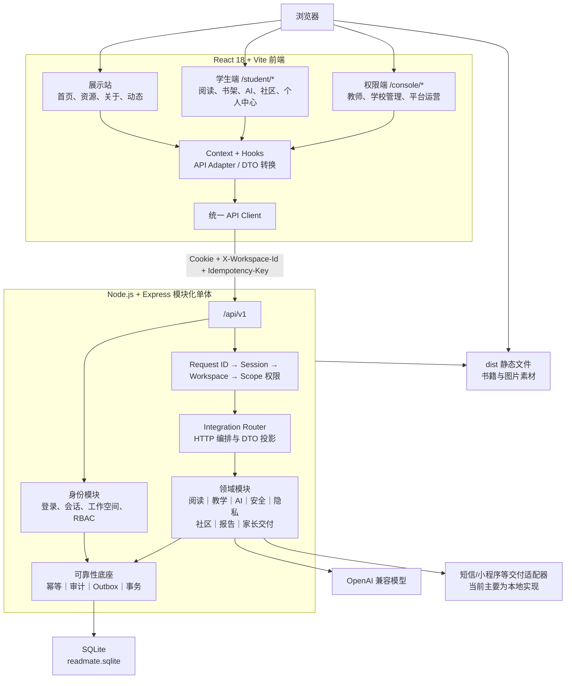

# 读伴项目架构说明

> 说明日期：2026-08-09  
> 分析范围：`source/bubu-book-reader` 最终源码快照  
> 交接基线：`codex/integration-v1`，提交 `d4ce07b44ee4daf48d2173d51e7329008e78abbe`

## 1. 架构结论

本项目当前是一套面向本地演示和继续开发的**领域模块化单体应用**，不是微服务架构。

整体运行形态为：

- 一套 React/Vite 单页应用，包含展示站、学生端和权限端三个入口；
- 一个 Node.js/Express 服务进程，统一提供 `/api/v1` 接口并托管前端构建产物；
- 一个 SQLite 数据库文件，保存身份、阅读、教学、AI、安全、社区、报告等全部领域数据；
- OpenAI 兼容模型、家长消息发送、电子书包等能力通过 Provider、Adapter 或领域边界接入。



## 2. 技术栈

| 层次 | 技术 | 说明 |
|---|---|---|
| 前端框架 | React 18 | 页面、组件、Context 状态管理 |
| 前端构建 | Vite 5 | 开发服务器、构建、路由分包 |
| 样式 | Tailwind CSS 3.4 | 学生端和权限端视觉实现 |
| 路由 | React Router 6，BrowserRouter | 展示站、学生端、权限端统一路由入口 |
| 后端运行时 | Node.js ≥ 22.16 | 使用内置 `node:sqlite`、原生 Fetch 等能力 |
| HTTP 服务 | Express 4 | API、静态文件和 SPA 路由回退 |
| 数据库 | SQLite | 本地持久化、WAL、外键约束、同步事务 |
| AI 接入 | OpenAI 兼容 Chat Completions | 结构化问答和安全二次复核 |
| 测试 | Node.js Test Runner | 前端契约测试、后端领域及 HTTP 集成测试 |

项目采用前端根包和 `server` 后端子包分别安装依赖的方式，目前没有使用 npm workspace。

## 3. 目录结构

```text
bubu-book-reader/
├── src/                       # React 前端
│   ├── App.jsx                # 三类前端入口的总路由
│   ├── api/                   # API Client 与接口封装
│   ├── adapters/              # 后端 DTO → 页面 ViewModel
│   ├── student/               # 学生端壳、页面、状态和组件
│   ├── console/               # 教师/学校/运营权限端
│   ├── pages/                 # 展示站页面
│   └── components/            # 展示站公共组件
├── server/                    # Node/Express 后端
│   ├── app.js                 # 应用装配与静态文件托管
│   ├── index.js               # 服务启动入口
│   ├── auth/                  # 密码和会话签名
│   ├── middleware/            # 请求、会话、工作空间中间件
│   ├── http/                  # API 路由和公共页面响应
│   ├── integration/           # 领域编排、DTO 投影、外部 Provider
│   ├── domains/               # 业务领域模块
│   └── db/                    # SQLite、迁移、审计、幂等和 Outbox
├── tests/
│   ├── frontend/              # 前端路由、契约和运行模块图测试
│   └── server/                # 后端领域、数据库和 HTTP 测试
├── public/                    # 前端静态资源
├── docs/                      # 一体化契约与架构文档
├── vite.config.js
└── package.json
```

## 4. 前端架构

### 4.1 总入口

`src/main.jsx` 使用 `BrowserRouter` 挂载 `src/App.jsx`。`App.jsx` 将前端分为三个入口：

| 入口 | 路径 | 定位 |
|---|---|---|
| 展示站 | `/`、`/resources`、`/about`、`/blog` | 项目介绍和公开展示内容 |
| 学生端 | `/student/*` | 学生阅读、AI、社区和个人阅读资产 |
| 权限端 | `/console/*` | 教师、学校管理员和平台运营工作台 |

学生端和权限端通过路由懒加载进入，第三方依赖在 Vite 构建中拆分为 React 和图标 Vendor 包。

### 4.2 学生端

学生端入口为 `src/student/StudentApp.jsx`，主要组成如下：

- `StudentShell`：学生端页面框架和主导航；
- `StudentProvider`：学生身份、书籍、阅读进度、AI 会话和视觉偏好；
- `StudentCommunityProvider`：学生社区运行状态；
- `pages/Reader.jsx`：正文阅读、选文、批注、阅读遥测和 AI 陪读；
- `state/`：阅读统计、个人书库、护眼、课堂、AI 等业务 Hooks；
- `components/`：书封、阅读页、AI 面板、吉祥物和通用学生端组件。

学生端主要业务路由包括：

- 首页和书架；
- 书籍详情和阅读器；
- 社区、投稿和帖子详情；
- 足迹、摘录、笔记、书单、等级和用量；
- 教师互动和课堂状态。

### 4.3 权限端

权限端入口为 `src/console/ConsoleApp.jsx`。同一套壳根据用户工作空间承载：

- 教师工作空间；
- 年级或学校管理工作空间；
- 平台运营工作空间。

`ConsoleProvider` 负责当前操作员、工作空间切换、权限端导航和界面偏好。页面访问不仅受前端导航限制，服务端还会重新执行权限和数据范围检查。

权限端业务范围包括：

- 教学安排、书库、书目详情和课堂阅读；
- 班级概览、学生目录、学生详情和护眼状态；
- AI 会话访问申请和隐私记录；
- 社区审核、安全事件、报告和家长发送；
- 平台审计。

历史 fixture 页面仍保留在源码中，但生产入口的运行模块图不会加载这些页面。尚无真实接口的功能会显示禁用或真实空态，不在浏览器本地伪造保存成功。

### 4.4 API 与状态流

前端没有引入 Redux，采用以下分层：

```text
Page / Component
    ↓
Context + Domain Hook
    ↓
src/api 接口封装
    ↓
统一 API Client
    ↓
/api/v1
```

统一 API Client 的职责包括：

- 默认以 `/api/v1` 为基础路径；
- 使用 `credentials: include` 携带服务端会话 Cookie；
- 通过 `X-Workspace-Id` 指定当前工作空间；
- 强制所有 POST、PUT、PATCH、DELETE 请求提供 `Idempotency-Key`；
- 解析统一的 `{ data, meta }` 和 `{ error }` 响应信封；
- 把网络、HTTP 和后端业务错误转换成统一 `ApiError`。

## 5. 后端架构

### 5.1 应用装配

`server/index.js` 读取运行参数并调用 `createReadmateApplication()`。`server/app.js` 完成以下装配：

1. 创建身份模块并打开 SQLite；
2. 启动时执行数据库迁移；
3. 创建业务 Integration Router；
4. 将身份路由和业务路由都挂载到 `/api/v1`；
5. 生产环境托管 `dist`、`/books` 素材和 SPA 路由回退；
6. 关闭服务时释放数据库连接。

这是一个单进程、单数据库部署单元，各领域之间通过同一进程内的函数调用协作。

### 5.2 请求中间件

受保护请求依次经过：

1. 请求 ID 创建或校验；
2. HttpOnly Cookie 会话验证；
3. `X-Workspace-Id` 工作空间验证；
4. 角色动作和资源范围授权；
5. 领域服务执行；
6. 统一成功或错误响应。

身份授权不是单纯的角色判断，而是以下条件的组合：

```text
角色允许的动作
    + 当前工作空间
    + 组织边界
    + own / class / grade / school / platform 数据范围
```

### 5.3 HTTP 编排层

`server/http/integration-router.js` 是主要业务 API 编排入口，负责：

- 路由定义和请求参数读取；
- 会话、工作空间和权限调用；
- 为每个请求创建领域依赖；
- 幂等执行和事务边界；
- 查询结果投影为前端 DTO；
- 调度安全通知和部分 Outbox；
- 将领域错误转换为 HTTP 错误。

该文件集中承载了较多职责，是当前后端最明显的复杂度集中点。

## 6. 领域模块

| 领域 | 目录 | 主要职责 |
|---|---|---|
| 身份与权限 | `server/domains/identity` | 组织、用户、工作空间、角色、会话和范围授权 |
| 阅读 | `server/domains/reading` | 书目、版本、书页、阅读进度、遥测、租约和统计 |
| 个人书库 | `server/domains/reading/library-objects.js` | 收藏、书单、书签、摘录和批注 |
| 护眼 | `server/domains/reading/eyecare.js` | 阅读时长窗口、护眼状态和误报解除 |
| 教学课堂 | `server/domains/teaching` | 阅读安排、课堂会话、控制权、翻页同步和广播 |
| AI | `server/domains/ai` | 对话、检索、引用、用量、配额和 SQLite 适配 |
| 安全 | `server/domains/safety` | 风险策略、二次复核、安全事件和通知对象 |
| 隐私 | `server/domains/privacy` | 私密会话访问申请、审批、授权和访问历史 |
| 社区 | `server/domains/community` | 投稿、班级一审、学校二审和互动 |
| 报告 | `server/domains/reports` | 报告生成、版本和人工复核 |
| 家长交付 | `server/domains/delivery` | 联系人、发送任务、回执、对账和公开摘要链接 |
| 电子书包桥接 | `server/domains/bridge` | 签名令牌、启动上下文和返回契约 |

电子书包桥接已经存在领域实现和专项测试，但当前没有注册到正式的 Integration Router，因此不能视为已经完成外部宿主联调。

## 7. 数据架构

### 7.1 SQLite 连接

数据库由 `server/db/database.js` 使用 Node 内置 `node:sqlite` 的 `DatabaseSync` 打开。

默认设置：

- 数据库文件：`server/data/readmate.sqlite`；
- `PRAGMA foreign_keys = ON`；
- `PRAGMA journal_mode = WAL`；
- `PRAGMA busy_timeout = 5000`；
- 连接和领域事务均以同步方式执行。

### 7.2 迁移分组

| 编号 | 领域 |
|---|---|
| `000～005` | 身份、会话、权限强化、幂等和可靠性 |
| `010～015` | 书目、阅读活动、课堂教学和电子书包 |
| `020～026` | AI、隐私、安全复核和安全通知 |
| `030～033` | 社区、报告、家长交付和多阶段审核 |
| `040～042` | 个人书库、护眼隐私和 AI 对话管理 |

迁移运行器会：

- 按三位数字编号排序；
- 为每个 SQL 文件计算 SHA-256；
- 在 `schema_migrations` 中保存校验和；
- 拒绝已经执行后又被修改的迁移；
- 在事务中执行尚未应用的迁移。

### 7.3 核心数据域

数据库包含以下主要数据组：

- 组织、用户、工作空间、角色和班级；
- 会话凭据和可信身份；
- 书籍、版本、页面、正文块和资源；
- 阅读租约、事件、会话、进度和护眼数据；
- AI 对话、消息、证据、用量和安全复核；
- 社区帖子、审核和互动；
- 报告、家长联系人、交付任务、发送尝试和回执；
- 审计、幂等、Outbox 和任务运行记录。

## 8. 可靠性与安全横切能力

### 8.1 幂等

所有业务写请求都要求提供 `Idempotency-Key`。服务端根据请求范围和请求摘要保存执行结果，重复请求可以返回原结果，冲突复用会被拒绝。

幂等范围通常包含：

- 组织；
- 当前用户；
- 工作空间；
- 资源；
- HTTP 方法和路由。

### 8.2 审计

身份变更、AI 消息、隐私访问、安全事件、社区审核和报告交付等关键操作会写入 `audit_events`。审计记录包含请求 ID、操作者、工作空间、资源和范围快照。

### 8.3 Outbox

领域写入可以在同一数据库事务中写入 `outbox_events`，用于记录待处理的领域事件。当前安全通知已经具备数据库 Outbox 分发逻辑，但尚未形成独立、通用的后台 Worker 部署单元。

### 8.4 并发控制

项目综合使用：

- SQLite `BEGIN IMMEDIATE` 事务；
- 数据版本号和 ETag；
- 阅读设备租约；
- 课堂控制权；
- 幂等执行租约和 fencing；
- 发送任务 claim lease。

## 9. AI 与安全架构

学生 AI 请求的主要链路为：

```text
学生选文或提问
    ↓
校验组织、用户、书籍版本和当前已读范围
    ↓
只提取允许访问的正文 Evidence Block
    ↓
调用 OpenAI 兼容 Provider
    ↓
校验结构化字段、引用 ID、隐私和危险信号
    ↓
必要时创建安全二次复核
    ↓
持久化消息、引用、用量、审计和安全状态
```

关键设计包括：

- 模型只能引用后端提供的 Evidence ID；
- 未读页请求会在调用 Provider 前被拒绝；
- 模型不能自行决定安全通知对象；
- 涉事人员只能从后端生成的稳定账号候选中选择；
- 学生用量和 Provider 实际成本分别记账；
- 问答和安全二次复核可以复用同一外部 Provider 配置。

交接包启动器默认使用“确定性回归提供者”，用于稳定演示和测试。只有配置 `OPENAI_BASE_URL`、`OPENAI_API_KEY` 和 `MODEL_ID` 后才使用真实外部模型。

## 10. 典型请求链路

以学生创建书签为例：

1. 浏览器携带 HttpOnly 会话 Cookie；
2. 请求带当前 `X-Workspace-Id`；
3. 前端为写请求生成 `Idempotency-Key`；
4. Express 创建 Request ID；
5. 身份中间件验证会话；
6. 工作空间中间件重新确认成员关系；
7. 权限服务检查角色动作和学生本人范围；
8. Router 创建当前请求的领域依赖；
9. 个人书库领域在 SQLite 事务中写入书签；
10. 同一事务保存幂等结果和审计记录；
11. 后端返回 `{ data, meta }`；
12. 前端 Hook 刷新资源并更新页面。

## 11. 开发与部署形态

### 11.1 开发模式

```text
Vite 开发服务器：127.0.0.1:5190
            │
            └── /api 代理到 127.0.0.1:5191

Express 后端：127.0.0.1:5191
```

### 11.2 交接包演示模式

`Start-ReadmateDemo.ps1` 会：

1. 分别安装前端和后端依赖；
2. 构建前端 `dist`；
3. 在本机私有运行目录生成 SQLite 和随机演示账号；
4. 导入公共领域测试书目；
5. 默认注入确定性回归 AI Provider；
6. 由 Express 同源托管前端和 API。

浏览器直接访问 `http://127.0.0.1:5191/student/login` 或 `/console/login`。

### 11.3 生产边界

当前交接包未完成或未验证：

- 正式服务器部署与高可用；
- 多实例并发和数据库共享；
- PostgreSQL 迁移；
- 正式对象存储；
- 正式短信和小程序回执；
- 学校平板、白板和电子书包宿主联调；
- 通用异步任务 Worker；
- 完整生产安全加固和监控告警。

因此当前版本应被视为本地演示与继续开发基线，而不是可直接上线的生产版本。

## 12. 测试结构

`tests/frontend` 主要验证：

- API 契约和错误信封；
- 学生端、权限端路由接线；
- 前端 Adapter 和 ViewModel；
- 阅读遥测、AI 会话和社区交互；
- 生产入口不加载 fixture、mock 或本地业务存储。

`tests/server` 主要验证：

- 身份、会话、RBAC 和跨组织边界；
- SQLite 迁移和数据完整性；
- 幂等、fencing、审计和 Outbox；
- 阅读、教学、课堂和电子书包契约；
- AI 引用、安全复核、隐私和用量；
- 社区审核、报告和家长交付；
- 真实 HTTP 与 SQLite 集成链路。

交接验证记录显示，基线提交当时完整前端测试为 91/91，完整后端测试为 141/141；该数字属于交接记录，不代表此文档生成时重新执行了全部测试。

## 13. 当前架构优势

1. **业务边界已经形成**：代码按身份、阅读、教学、AI、安全等领域拆分，而不是全部堆在页面或路由中。
2. **权限模型较完整**：RBAC 与工作空间、组织、班级、年级、本人范围结合。
3. **可靠性规则进入主链路**：幂等、审计、Outbox、版本控制和租约不是仅停留在文档中。
4. **AI 数据边界清晰**：已读范围、引用证据、安全二次复核和人员候选均由后端控制。
5. **演示数据边界诚实**：生产入口不加载 fixture，未实现动作不伪造成功。
6. **单体部署便于当前阶段交付**：一套进程和 SQLite 即可复现主要业务链路。

## 14. 主要技术债与风险

### 14.1 文档漂移

源码根目录 `README.md` 仍描述“纯静态、零后端、HashRouter”，`DEPLOY.md` 仍包含旧 `/api/chat` 架构；实际代码已经使用 BrowserRouter、Express 和 `/api/v1`。

后续应以交接包根目录 `README_先看.md`、`验证/verification.md` 和当前代码为准，并更新或归档旧文档。

### 14.2 HTTP 编排层过重

`server/http/integration-router.js` 同时负责路由、授权、DTO 投影、事务、幂等和部分事件调度。随着业务增长，该文件会成为修改冲突和回归风险的集中点。

建议后续按领域拆为多个 Router/Application Service，并让 HTTP 层只处理协议转换。

### 14.3 SQLite 耦合较强

除身份领域有较明确的 Repository 外，多数领域直接编写 SQLite SQL，并依赖同步事务和 `DatabaseSync` 接口。

因此“迁移 PostgreSQL”不是替换连接字符串即可完成，需要：

- 定义数据库端口或 Repository；
- 处理参数、返回值和 SQL 方言差异；
- 把同步事务改为异步事务；
- 重新设计并发、锁和租约；
- 重写迁移运行器并执行完整回归。

### 14.4 遗留代码仍在源码中

仓库仍保留旧展示壳、旧 `/api/chat` Client、历史 fixture 页面和部分不可达组件。虽然当前生产入口测试阻止它们被加载，但会增加认知成本和误用风险。

### 14.5 外部基础设施尚未闭环

家长发送默认使用本地 Adapter，电子书包桥接没有注册正式 HTTP 路由，正式短信、小程序、学校设备和对象存储也未完成真实环境验证。

### 14.6 单进程与 SQLite 的扩展限制

当前架构适合本地演示和小规模单机运行，但不适合直接扩展为多实例高并发服务。SQLite 同步写入、进程内调度和本地素材目录都会成为水平扩展约束。

## 15. 建议的后续演进顺序

1. 更新 README 和部署文档，确定当前代码为唯一事实来源；
2. 清理不可达的旧 `/api/chat`、fixture 页面和旧展示代码；
3. 按领域拆分 `integration-router.js`；
4. 为数据库访问建立稳定 Repository/Port 边界；
5. 将 Outbox 调度抽成独立 Worker，并增加失败重试和监控；
6. 接入并验收正式消息、对象存储和电子书包环境；
7. 明确生产容量后，再决定继续使用 SQLite 还是迁移 PostgreSQL；
8. 补齐生产部署、安全、备份、恢复、可观测性和容量测试。

## 16. 关键文件索引

| 文件 | 用途 |
|---|---|
| `src/main.jsx` | React 和 BrowserRouter 启动入口 |
| `src/App.jsx` | 展示站、学生端和权限端总路由 |
| `src/student/StudentApp.jsx` | 学生端路由与 Provider |
| `src/console/ConsoleApp.jsx` | 权限端路由与工作台入口 |
| `src/api/client.js` | 统一 API Client |
| `server/index.js` | 后端进程入口 |
| `server/app.js` | Express 应用装配和静态文件托管 |
| `server/http/integration-router.js` | 主要业务 API 编排 |
| `server/middleware/request-context.js` | 请求、会话和工作空间中间件 |
| `server/domains/identity/permissions.js` | 角色动作和数据范围授权 |
| `server/integration/context.js` | 将 HTTP 请求转换为领域依赖 |
| `server/integration/ai-runtime.js` | AI、检索、用量和安全模块装配 |
| `server/integration/external-openai-provider.js` | 外部 OpenAI 兼容 Provider |
| `server/db/database.js` | SQLite 连接和同步事务 |
| `server/db/migrate.js` | SQL 迁移运行器 |
| `server/db/reliability.js` | 幂等、审计和 Outbox |
| `server/db/migrations/` | 按领域编号的数据库迁移 |

